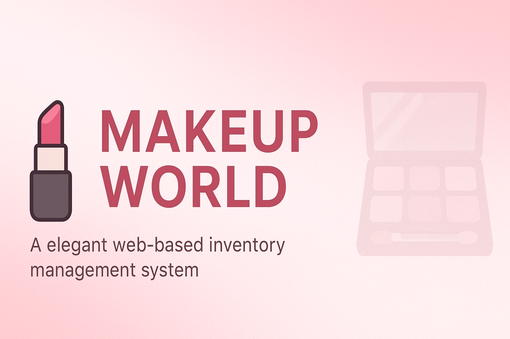

<!-- Banner -->
<p align="center">
  
</p>

<h1 align="center">💄 Makeup World Inventory App</h1>

<p align="center">
  <b>A modern web-based inventory management system for makeup products — built with Flask.</b>
</p>

<p align="center">
  <a href="https://github.com/Rumaisas-islam/makeup-world-website/stargazers">
    
  </a>
  <a href="https://github.com/Rumaisas-islam/makeup-world-website/issues">
    
  </a>
  
  
  
</p>

---

## 🌸 Overview
**Makeup World** is a lightweight inventory management web app designed for beauty stores and product managers to manage makeup products effortlessly.  
It provides a **login system**, **product CRUD operations**, and a **beautiful interface** for managing items by category, brand, and stock.

---

## 🧠 Features
✅ Secure Admin Login  
✅ Add / Edit / Delete Products  
✅ Product Listing with Details  
✅ SQLite Database Integration  
✅ Fully Tested with Pytest  
✅ Clean & Modern UI  

---

## 🗂️ Folder Structure
```

makeup-world-website/
├── app.py
├── requirements.txt
├── models.py
├── makeup.db
├── README.md
├── LICENSE
├── banner.png
├── static/
│   ├── style.css
│   └── uploads/
├── templates/
│   ├── base.html
│   ├── index.html
│   ├── login.html
│   ├── add_product.html
│   ├── edit_product.html
│   └── products.html
├── tests/
│   ├── test_app.py
│   └── **init**.py
└── sample_output/
└── products_sample.json

```

---

## ⚙️ Installation

### 1️⃣ Clone the repository
```bash
git clone https://github.com/Rumaisas-islam/makeup-world-website.git
cd makeup-world-website
````

### 2️⃣ Create and activate a virtual environment

```bash
python -m venv venv
source venv/bin/activate   # On Windows: venv\Scripts\activate
```

### 3️⃣ Install dependencies

```bash
pip install -r requirements.txt
```

### 4️⃣ Run the app

```bash
python app.py
```

Then open **[http://127.0.0.1:5000/](http://127.0.0.1:5000/)** in your browser 🎀

---

## 🧪 Running Tests

The app includes unit tests for all key features.

```bash
pytest -v --disable-warnings
```

---

## 💾 Admin Login

| Field        | Default Value |
| ------------ | ------------- |
| **Username** | `admin`       |
| **Password** | `1234`        |

---

## 📸 Preview

*(Add screenshots of your app UI here later)*

---

## 🛠️ Built With
- **Flask** – Backend framework  
- **SQLite** – Lightweight database  
- **HTML5 / CSS3** – Frontend  
- **Pytest** – Testing  


## 👩‍💻 Author

**[Rumaisa Islam](https://github.com/Rumaisas-islam)**
✨ Passionate about clean design, modern web apps, and creative UI/UX.

---

## 📜 License

This project is licensed under the **MIT License**.
Feel free to modify and use it for your personal or commercial projects.

---

<p align="center">Made with ❤️ by Rumaisa Islam 💅</p>
```